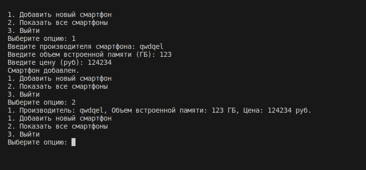

# Структуры 

## Цель:
 Знакомство с абстрактными типами данных

## Задачи
    2. Создать по 2 экземпляра структуры
    3. Создать функцию ввода структуры из консоли: параметром принимать указатель на структуру.
    4. Создать функцию вывода структуры: печатает сведения о экземпляре структуры.
    5. Функция, которая создает динамически экземпляры структуры, сохраняет их в вектор.
    6. Функция main должна иметь псевдоменю. В зависимости от введенной цифры должны вызываться те или иные функции.

## Вариант 1

## Код
```
#include <iostream>
#include <vector>
#include <string>

struct Smartphone {
    std::string manufacturer;
    int memory_size;
    double price;
};

// Функция ввода структуры из консоли
void input_smartphone(Smartphone &smartphone) {
    std::cout << "Введите производителя смартфона: ";
    std::cin >> smartphone.manufacturer;
    std::cout << "Введите объем встроенной памяти (ГБ): ";
    std::cin >> smartphone.memory_size;
    std::cout << "Введите цену (руб): ";
    std::cin >> smartphone.price;
}

// Функция вывода структуры
void print_smartphone(const Smartphone &smartphone) {
    std::cout << "Производитель: " << smartphone.manufacturer 
              << ", Объем встроенной памяти: " << smartphone.memory_size << " ГБ"
              << ", Цена: " << smartphone.price << " руб." << std::endl;
}

// Функция создания динамических экземпляров структуры и сохранения их в вектор
std::vector<Smartphone> create_smartphones() {
    std::vector<Smartphone> smartphones;
    int n;
    std::cout << "Сколько смартфонов вы хотите создать? ";
    std::cin >> n;
    for (int i = 0; i < n; ++i) {
        Smartphone smartphone;
        input_smartphone(smartphone);
        smartphones.push_back(smartphone);
    }
    return smartphones;
}

int main() {
    std::vector<Smartphone> smartphones;
    int choice;

    do {
        std::cout << "1. Добавить новый смартфон\n"
                  << "2. Показать все смартфоны\n"
                  << "3. Выйти\n"
                  << "Выберите опцию: ";
        std::cin >> choice;

        switch (choice) {
            case 1: {
                Smartphone smartphone;
                input_smartphone(smartphone);
                smartphones.push_back(smartphone);
                std::cout << "Смартфон добавлен.\n";
                break;
            }
            case 2: {
                if (smartphones.empty()) {
                    std::cout << "Список смартфонов пуст.\n";
                } else {
                    for (size_t i = 0; i < smartphones.size(); ++i) {
                        std::cout << i + 1 << ". ";
                        print_smartphone(smartphones[i]);
                    }
                }
                break;
            }
            case 3:
                std::cout << "Выход из программы.\n";
                break;
            default:
                std::cout << "Неверный выбор. Попробуйте еще раз.\n";
                break;
        }
    } while (choice != 3);

    return 0;
}
```

## Результат работы программы 
||

## Вывод:
Программа работает верно, без каких-либо ошибок и были усвоены нужные знания.
